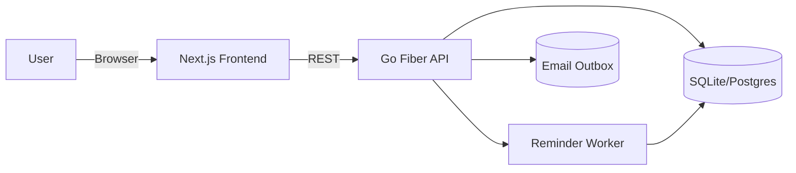
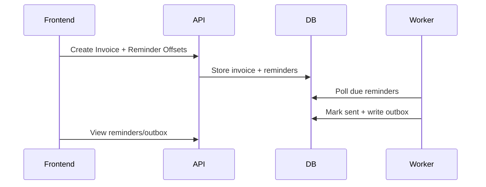

# NudgePay

## Business analysis
- **Target user**: Freelancers, small agencies, and boutique studios that invoice clients and lose time to late payments.
- **Market forces**:
  - Cash flow volatility is a top pain point for small businesses.
  - Invoicing tools exist, but reminder automation is often locked behind higher tiers.
  - Agencies need a lightweight, single-purpose tool instead of full ERP stacks.
- **Competitive gap**:
  - Many invoicing apps emphasize accounting, not follow-up workflows.
  - Few tools focus on reminder cadence, tone, and audit trails.
  - Lightweight reminders with clear ROI (reduced DSO) have room in the mid-market.
- **Pricing**:
  - Starter: $12/mo for up to 50 active invoices.
  - Growth: $29/mo for up to 300 active invoices + multiple templates.
  - Pro: $59/mo for up to 1,500 active invoices + team members (future).

## Feature map
- **Essential**
  - Email/password auth with organization setup.
  - Client directory.
  - Invoices with due dates and status.
  - Reminder schedule (offsets from due date).
  - Reminder sending (outbox log).
  - Dashboard metrics.
- **Important**
  - Templates with merge variables.
  - Overdue analytics (DSO proxy).
  - Export reminders as CSV.
  - Team members and roles.
- **Optional**
  - SMTP integrations.
  - Payment links.
  - Auto-escalation sequences.
  - AI tone suggestions.

## System architecture

- **Data flow**: Frontend calls REST API with JWT. API reads/writes to DB. Worker scans scheduled reminders and writes to outbox, marking reminders sent.
- **Dependencies**: Fiber, SQLite (swap to Postgres), JWT, bcrypt, Next.js, React, Vitest.
- **Hosting**:
  - Backend: Fly.io or Render, containerized.
  - Frontend: Vercel or Cloudflare Pages (Next.js).
  - Database: SQLite for single-tenant, Postgres for scale.
- **Containerization**: Multi-stage Docker builds for API and frontend.
- **CI/CD**:
  - GitHub Actions running Go + frontend tests, lint, and build checks.
  - Deploy on main branch to hosting providers.

## API specification
- See `backend/openapi.yaml` for full OpenAPI 3.1 document.

## Roadmap
- **v0.1**: Auth, clients, invoices, reminder scheduling, outbox logging.
- **v0.1.1**: Template manager, dashboard metrics, CSV export.
- **v0.2**: Team roles, webhook integrations, SMTP settings.
- **v1.0**: Billing, multi-tenant usage limits, advanced analytics.

## Agentic development workflow
- **Product agent**: Defines scope, pricing, and feature map in `docs/PRODUCT.md`.
- **Backend agent**: Implements Go API, migrations, services, and tests.
- **Frontend agent**: Implements Next.js UI, API client, and UI tests.
- **Infra agent**: Writes Docker, compose, k8s, and CI workflows.
- **QA agent**: Runs tests, verifies OpenAPI, checks flows end to end.

## 20 next steps for refinement
1. Add SMTP provider integrations with DKIM guidance.
2. Build a WYSIWYG template editor.
3. Add invoice import from CSV/QuickBooks.
4. Support multiple currencies and locale formatting.
5. Add customizable reminder sequences per client.
6. Implement team roles and audit log.
7. Add webhooks for payment status updates.
8. Create Stripe billing integration with usage limits.
9. Implement SSO (Google/Microsoft).
10. Add dunning sequence analytics dashboard.
11. Add payment links with Stripe Checkout.
12. Create scheduled exports for accountant.
13. Improve mobile UX with offline caching.
14. Add multi-org support for agencies.
15. Add tags for invoices and clients.
16. Build reminder A/B testing.
17. Add in-app notification center.
18. Add read receipts via tracking pixel.
19. Implement per-client time zones.
20. Add GDPR tools (data export/delete).
